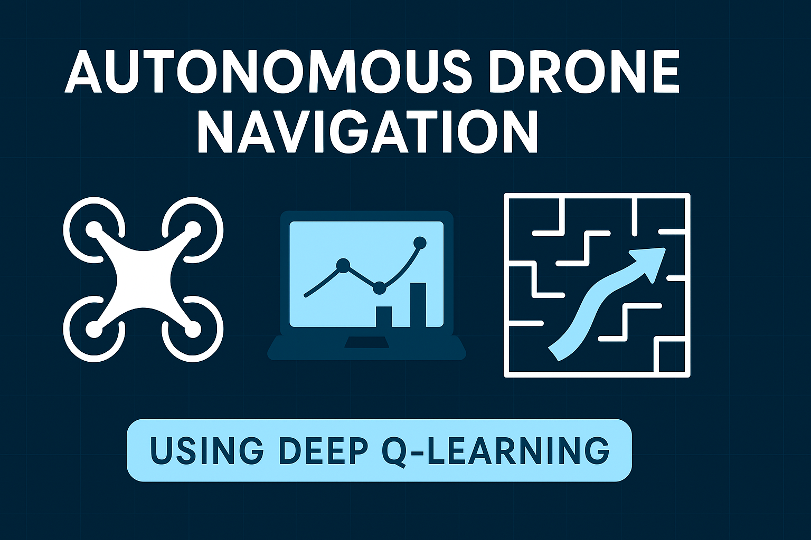

# Autonomous Drone Navigation 🛸🤖



## 🚀 Project Overview
**Autonomous Drone Navigation** is a deep reinforcement learning project developed during the **CodeClause Artificial Intelligence Internship (Golden Level)**. This project trains a drone (simulated using OpenAI Gym's CartPole) to navigate autonomously, avoid obstacles, and reach target locations.

## 📌 Features
- Autonomous control using Deep Q-Learning (DQN)
- Uses simulation environment for safe training
- Modular, easy-to-understand code structure
- Potential to integrate with real drone simulators like AirSim

## 🧠 Technologies Used
- Python
- OpenCV
- PyTorch
- OpenAI Gym
- NumPy

## 🛠️ Installation

Clone the repository and install required packages:

```bash
git clone https://github.com/harika1807/CodeClauseInternship_AutonomousDroneNavigation.git
cd CodeClauseInternship_AutonomousDroneNavigation
pip install -r requirements.txt
```

## 🧪 How to Run

Open the Jupyter Notebook or run the Python file:

- In Jupyter Notebook: open `AutonomousDroneNavigation.ipynb`
- Or run: `python drone_navigation.py`

You can also try it in [Google Colab](https://colab.research.google.com/github/harika1807/CodeClauseInternship_DroneNavigation/blob/main/DroneNavigation.ipynb) for free cloud execution.

## 🎯 Project Objective

Build an AI system that enables a drone to navigate autonomously using:
- 📸 Computer Vision
- 🧭 SLAM (Simultaneous Localization and Mapping)
- 🧠 Deep Reinforcement Learning

## 📂 File Structure

```
📁 CodeClauseInternship_AutonomousDroneNavigation/
│
├── drone_navigation.py         # Python code for training the agent
├── AutonomousDroneNavigation.ipynb  # Jupyter notebook version
├── banner.png                  # Project banner image
├── README.md                   # Project documentation
├── requirements.txt            # Dependencies
└── .gitignore                  # Git ignore file
```

## 📜 License
This project is licensed under the MIT License. See the [LICENSE](LICENSE) file for more details.

## 🤝 Contributing
Contributions are welcome!

- Fork the repository
- Create your feature branch: `git checkout -b feature/FeatureName`
- Commit your changes
- Push to the branch
- Open a Pull Request 🚀

---

> Made with ❤️ by Harika Devi Seelam as part of the CodeClause Artificial Intelligence Internship
